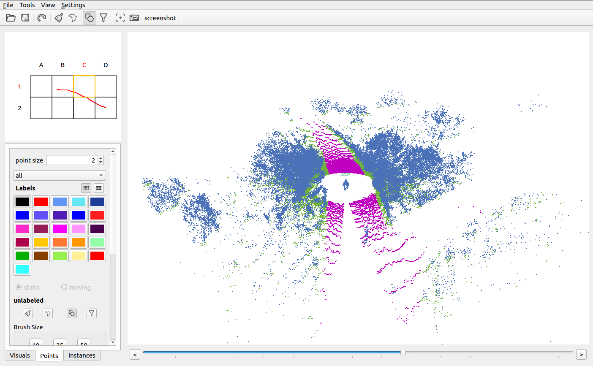

# kadl_pcss


## Dataset

<p align="center">
    
</p>
<p align="center">
    
</p>

We reorganized the data in the Rellis-3D dataset according to the format of Semantickitti.  To unify the target categories in the scenes,
we remap the classes in the above two datasets into Road, Obstacle, Neutral area, and Others.

Rellis-3D:https://github.com/unmannedlab/RELLIS-3D

Semantickitti: http://www.semantic-kitti.org/

The sequence correspondence is as follows :

Seq in Rellis-3D | 00000 | 00001 | 00002 |  00003 |  00004 | 
-------| ----| ------|------|------|----------|
New Seq with Semantickitti format  |33 |34|35|36|37| 

(Note: The original sequences in the Semantickitti dataset are 00-21)


### Semantickitti + Rellis-3D
The original ".bin" files are stored in the folder **os1_cloud_node_kitti_bin** in Rellis-3D; 

".label" files were remade by us using the point cloud semantic labeling tool(https://github.com/jbehley/point_labeler).


```
./
├──sequences
        ├── 00/  # original sequence in Semantickitti
        ├── ...  # original sequence in Semantickitti
        └── 21/  # original sequence in Semantickitti
        ├── 33/  # new sequence from  Rellis-3D      
        │   ├── velodyne/	 # directory containing ".bin" files with Ouster 64-Channels point clouds
        |   |	├── 000000.bin
        |   |	├── 000001.bin
        |   |	└── ...
        │   └── labels/          
        |       ├── 000000.label
        |       ├── 000001.label
        |       └── ...
        ├── ... # new sequence from  Rellis-3D     
        └── 37/ # new sequence from  Rellis-3D     
```

## Code
Code coming soon!
